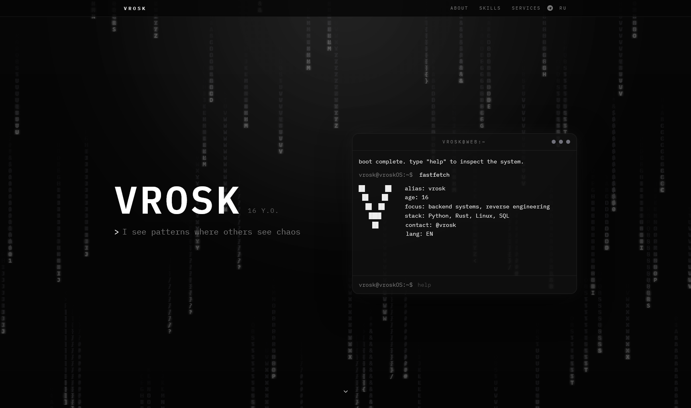
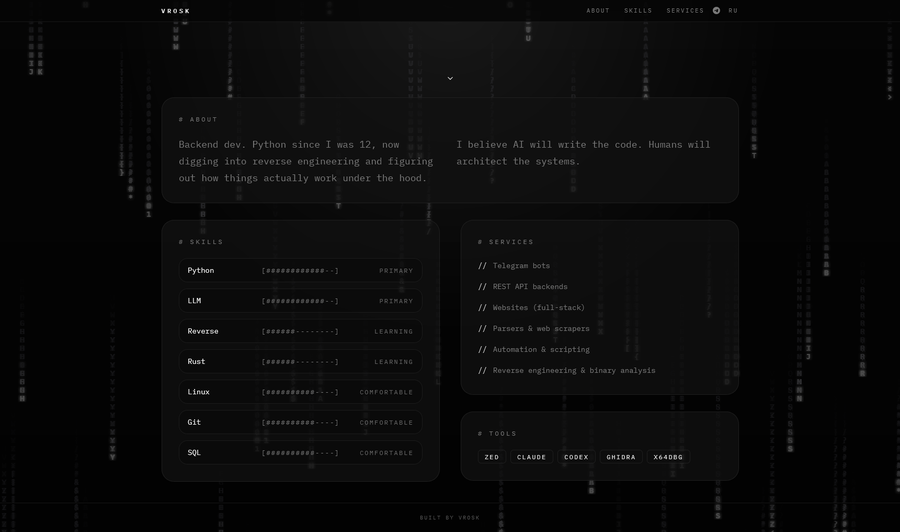

# vrosk ~ about

Personal portfolio site for `vrosk`: a dark one-page frontend with a terminal-first identity, bilingual content, matrix rain background, and a custom in-browser shell.

## Preview

<p align="center">
  
  
</p>

## Features

- One-page portfolio layout with responsive desktop/mobile behavior.
- Dark monochrome visual system built around `IBM Plex Mono`.
- EN/RU content switching with browser auto-detect and local persistence.
- Matrix rain canvas background with low-power and reduced-motion fallbacks.
- Interactive terminal window with a real parser/executor pipeline.
- Virtual filesystem with writable `/home/vrosk` and `/tmp`.
- Command history, tab completion, aliases, rich output coloring, pipes, redirects, and easter eggs.
- Static deployment flow for GitHub Pages.

## Terminal

The terminal is not a fake command switch. It is a small browser-side shell implementation:

- Lexer:
  Tokenizes words, quoted strings, short flags, long flags, pipes, and redirects.
- Parser:
  Builds a command pipeline AST with ordered argv, flags, stdin/stdout redirects, and syntax errors close to bash-style output.
- Executor:
  Runs commands stage-by-stage, threads `stdout` through pipes, keeps `stderr` separate, and supports terminal actions such as clear, language switch, matrix toggle, and destroy animation.
- VirtualFS:
  Deep-cloned static root tree plus mutable user space, UNIX-like permissions, dynamic `/proc/*` reads, and writable sandbox areas.
- Commands:
  Includes `ls`, `cat`, `cd`, `grep`, `find`, `head`, `tail`, `wc`, `mkdir`, `touch`, `rm`, `echo`, `neofetch`, `lang`, `matrix`, `git`, `sudo`, and other system-flavored responses.

## Tech Stack

- React 19
- Vite 8
- TypeScript
- Tailwind CSS v4
- Vitest
- gh-pages

## Project Structure

```text
src/
  components/
    terminal/
      ast.ts
      lexer.ts
      parser.ts
      executor.ts
      vfs.ts
      vfs-tree.ts
      commands/
  content/
    en.json
    ru.json
  hooks/
  lib/
public/
assets/
tests/
```

## Development

```bash
npm install
npm run dev
```

Open the local dev server and work normally with Vite hot reload.

## Scripts

```bash
npm run dev
npm run build
npm run test
npm run preview
npm run deploy
```

## Deployment

GitHub Pages deploy is configured through `gh-pages`:

```bash
npm run deploy
```

This project is configured for a GitHub Pages user site:

- Repository: `vrosk-z/vrosk-z.github.io`
- Vite base: `/`
- Final URL: `https://vrosk-z.github.io/`

Typical publish flow:

```bash
git push origin main
npm run deploy
```

In the repository settings, GitHub Pages should publish from:

- Branch: `gh-pages`
- Folder: `/(root)`

## Fonts

This project uses `IBM Plex Mono` via `@fontsource/ibm-plex-mono`.

Loaded subsets/weights in the app:

- Latin 400
- Latin 600
- Cyrillic 400
- Cyrillic 600

The font is self-hosted through the build output, not pulled from an external CDN at runtime.

## Credits

This project was built by `vrosk` with AI assistance from `Claude Opus 4.6` and `GPT-5.4`.

## License

Project source code is licensed under the MIT License.

See [LICENSE](./LICENSE).

## Third-Party Licenses

Direct packages currently used by the project:

| Package | Version | License |
| --- | --- | --- |
| `@fontsource/ibm-plex-mono` | `5.2.7` | `OFL-1.1` |
| `react` | `19.2.4` | `MIT` |
| `react-dom` | `19.2.4` | `MIT` |
| `vite` | `8.0.2` | `MIT` |
| `@vitejs/plugin-react` | `6.0.1` | `MIT` |
| `tailwindcss` | `4.2.2` | `MIT` |
| `@tailwindcss/vite` | `4.2.2` | `MIT` |
| `typescript` | `5.9.3` | `Apache-2.0` |
| `vitest` | `4.1.1` | `MIT` |
| `@testing-library/react` | `16.3.2` | `MIT` |
| `@testing-library/jest-dom` | `6.9.1` | `MIT` |
| `@types/node` | `24.12.0` | `MIT` |
| `@types/react` | `19.2.14` | `MIT` |
| `@types/react-dom` | `19.2.3` | `MIT` |
| `clsx` | `2.1.1` | `MIT` |
| `tailwind-merge` | `3.5.0` | `MIT` |
| `gh-pages` | `6.3.0` | `MIT` |
| `jsdom` | `29.0.1` | `MIT` |
| `terser` | `5.46.1` | `BSD-2-Clause` |

Notes:

- The project code itself is MIT.
- `IBM Plex Mono` remains under `OFL-1.1`.
- Other third-party packages remain under their own original licenses.
